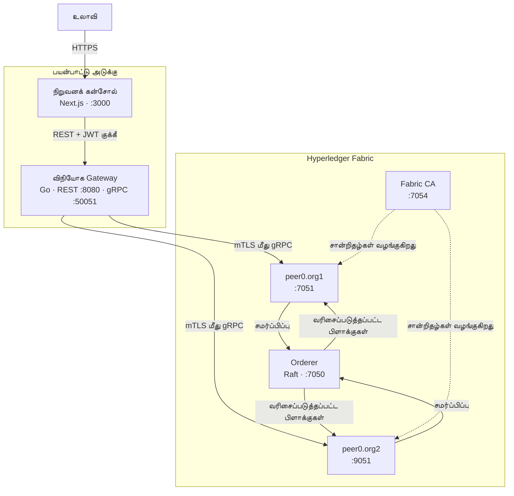
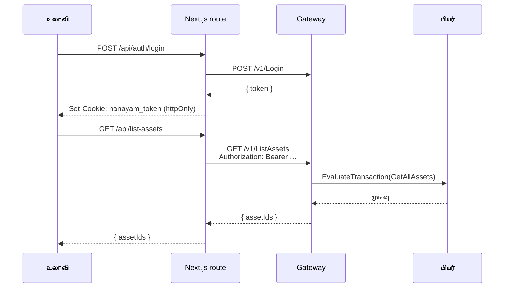
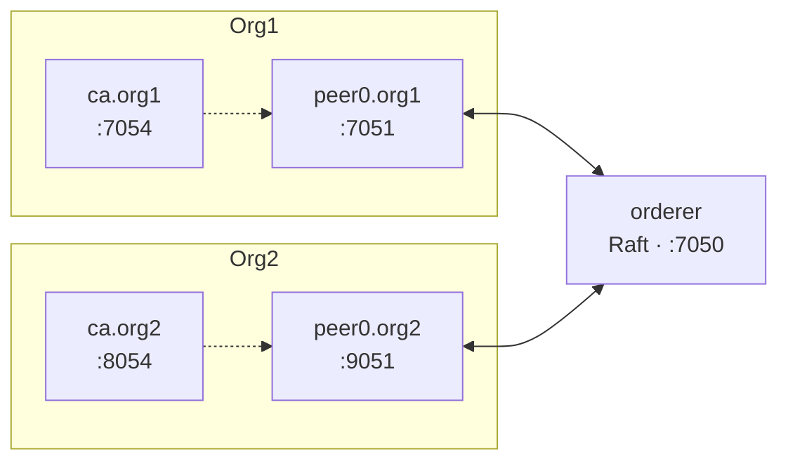
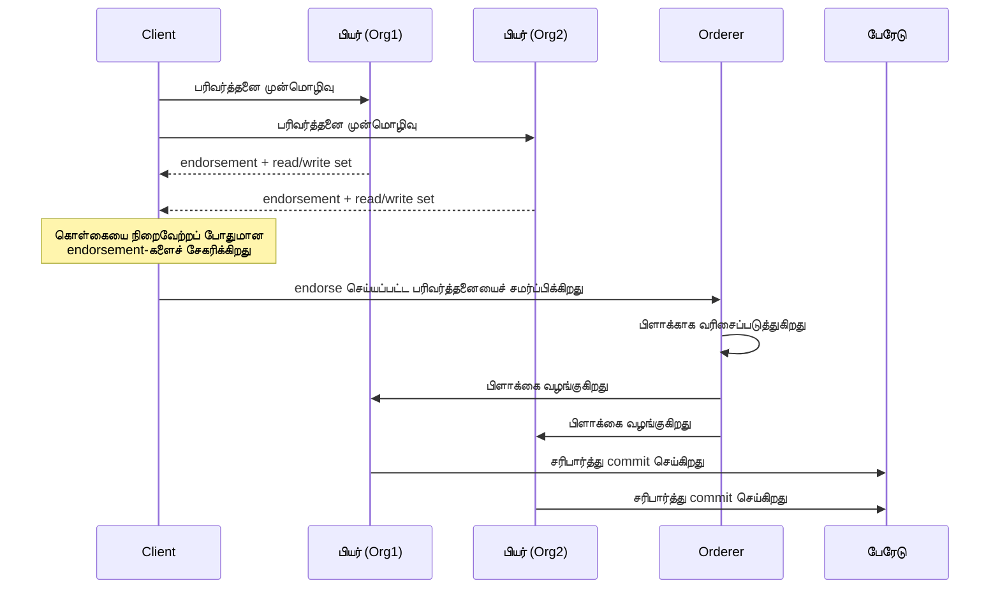

# கட்டமைப்பு

**மொழிகள்:** [English](Architecture.html) · **தமிழ்**

---

## முழுப் படம்

இங்கே இரண்டு தனித்தனி அடையாள அமைப்புகள் இயங்குகின்றன. இவற்றைக் குழப்பிக்கொள்வதுதான் மிகவும் பொதுவான குழப்பத்திற்குக் காரணம்:

- **கன்சோல் பயனர்கள்** பயனர்பெயர், கடவுச்சொல் மூலம் அங்கீகரிக்கப்பட்டு JWT பெறுகிறார்கள். இது வலை இடைமுகத்தை யார் பயன்படுத்தலாம் என்பதை நிர்ணயிக்கிறது.
- **Fabric அடையாளங்கள்** என்பவை Fabric CA வழங்கிய X.509 சான்றிதழ்கள். பேரேடு ஏற்கும் பரிவர்த்தனையில் யார் கையொப்பமிடலாம் என்பதை இது நிர்ணயிக்கிறது.

Gateway ஒரு Fabric அடையாளத்தை வைத்திருந்து, அங்கீகரிக்கப்பட்ட கன்சோல் பயனர்களின் சார்பாகச் செயல்படுகிறது. கன்சோல் கணக்கு மட்டும் வைத்திருப்பவரால் பேரேட்டில் எழுத முடியாது.

---

## நிறுவனக் கன்சோல் (`apps/org-console/`)

Next.js 15 App Router பயன்பாடு.

| பாதை | பங்கு |
|---|---|
| `src/app/(auth)/` | உள்நுழைவு, பதிவுப் பக்கங்கள் |
| `src/app/(console)/` | டாஷ்போர்டு, பேரேடு உலாவி, சேனல்கள், புகார்கள் |
| `src/app/api/` | Gateway-க்குப் பரிமாற்றும் route handlers |
| `src/components/` | இடைமுகக் கூறுகள் |
| `src/lib/` | பகிரப்பட்ட API client மற்றும் துணை நிரல்கள் |

**API routes ஏன் இருக்கின்றன.** உலாவி நேரடியாக gateway-உடன் பேசுவதே இல்லை. அது Next.js route handler-ஐ அழைக்கிறது; அது JWT-ஐ இணைத்து, சர்வர் பக்கத்திலிருந்து கோரிக்கையை அனுப்புகிறது. இதனால் டோக்கன் `httpOnly` குக்கீயில் தங்கி, பக்கத்தில் இயங்கும் எந்த JavaScript-ஆலும் அணுக முடியாததாக இருக்கிறது — எனவே cross-site scripting பிழை ஒன்று செயலில் உள்ள பேரேடு அமர்வைத் திருட முடியாது.

---

## விநியோக Gateway (`services/gateway/`)

gRPC மற்றும் REST இரண்டின் மூலமும் ஒரே செயல்பாடுகளை வெளிப்படுத்தும் Go சேவை.

| கோப்பு | பங்கு |
|---|---|
| `main.go` | இரு சர்வர்களையும் தொடங்குகிறது, சார்புகளை இணைக்கிறது, நிறுத்தத்தைக் கையாள்கிறது |
| `connection.go` | சூழல் அமைப்பிலிருந்து Fabric Gateway client-ஐ உருவாக்குகிறது |
| `handler.go` | Fabric மீது gRPC சேவையைச் செயல்படுத்துகிறது |
| `http.go` | REST routing, CORS, அங்கீகார middleware |
| `auth.go` | பயனர் சேமிப்பு, bcrypt hashing, JWT வழங்குதல் மற்றும் சரிபார்ப்பு |

### Submit மற்றும் Evaluate

Fabric இரண்டு செயல்பாடுகளை வேறுபடுத்துகிறது; gateway அவற்றை HTTP முறைகளுக்கு இணைக்கிறது:

| | Evaluate | Submit |
|---|---|---|
| பேரேட்டில் எழுதுகிறதா | இல்லை | ஆம் |
| Orderer வழியாகச் செல்கிறதா | இல்லை | ஆம் |
| தாமதம் | மில்லிவினாடிகள் | பிளாக் நேரம் |
| பயன்படுத்துவது | `QueryAsset`, `ListAssets` | `CreateAsset`, `SubmitComplaint` |

Evaluate என்பது ஒரு பியரின் உள்ளூர் நிலைத் தரவுத்தளத்தை மட்டும் படிப்பது. Submit என்பது முழு வாழ்க்கைச் சுழற்சி: கொள்கையை நிறைவேற்றப் போதுமான பியர்களால் endorsement, பிளாக்காக வரிசைப்படுத்தல், பிறகு ஒவ்வொரு பியரிலும் சரிபார்ப்பும் commit-உம்.

### அமைப்பு

| மாறி | இயல்புநிலை | நோக்கம் |
|---|---|---|
| `MSP_ID` | `Org1MSP` | Gateway எந்த நிறுவனமாகச் செயல்படுகிறது |
| `PEER_ENDPOINT` | `peer0.org1.nanayam.com:7051` | இணைக்க வேண்டிய பியர் |
| `CRYPTO_PATH` | `./crypto-config/…` | MSP பொருளின் மூலம் |
| `TLS_CERT_PATH` | பெறப்படுகிறது | பியரின் TLS CA சான்றிதழ் |
| `FABRIC_CHANNEL` | `mychannel` | பரிவர்த்தனை செய்யும் சேனல் |
| `FABRIC_CHAINCODE` | `basic` | அழைக்க வேண்டிய chaincode |
| `AUTH_JWT_SECRET` | மேம்பாட்டு இயல்புநிலை | டோக்கன்களில் கையொப்பமிடும் HMAC சாவி |
| `AUTH_SIGNUP_ENABLED` | `false` | `/v1/Register` புதிய பயனர்களை ஏற்குமா |
| `AUTH_SESSION_HOURS` | `24` | டோக்கன் ஆயுள் |

> புதிய clone உடனே இயங்க வேண்டும் என்பதற்காக `AUTH_JWT_SECRET`-க்கு ஒரு மேம்பாட்டு இயல்புநிலை உள்ளது. வேறு யாராவது அணுகக்கூடிய எந்த நிறுவலும் இதை அவசியம் அமைக்க வேண்டும். `scripts/deploy-cloud.sh` ஒரு சீரற்ற மதிப்பை உருவாக்கி Kubernetes Secret-இல் சேமிக்கிறது.

---

## நாணயம் CLI (`cli/`)

Cobra பயன்பாடு. `cmd/`-இல் உள்ள ஒவ்வொரு கட்டளைக் கோப்பும் ஒரு துணைக்கட்டளையுடன் இணைகிறது.

| தொகுப்பு | பொறுப்பு |
|---|---|
| `cmd/` | கட்டளை வரையறைகளும் அவற்றின் ஒருங்கிணைப்பு தர்க்கமும் |
| `internal/docker/` | Compose அழைப்பு, bind mount-களின் முன்கூட்டிய சரிபார்ப்பு |
| `internal/fabric/` | பைனரி கண்டுபிடிப்பு, பியர் சூழல் உருவாக்கம் |
| `internal/ca/` | Enrol, register-க்கான `fabric-ca-client` உறை |
| `internal/config/` | நோடு டெம்ப்ளேட்களை compose, cryptogen கோப்புகளாக மாற்றுகிறது |
| `templates/` | பைனரிக்குள் தொகுக்கப்பட்ட உட்பொதிக்கப்பட்ட டெம்ப்ளேட்கள் |

**முன்கூட்டிய சரிபார்ப்பு** தெரிந்துகொள்ள வேண்டிய பகுதி. `network up` எதையும் Docker-இடம் ஒப்படைப்பதற்கு முன், CLI compose கோப்பைப் பகுத்து, ஒவ்வொரு bind mount-ஐயும் தீர்த்து, MSP கோப்பகங்களில் `signcerts` உள்ளதா, TLS கோப்பகங்களில் `ca.crt`/`server.crt`/`server.key` உள்ளதா, குறிப்பிடப்பட்ட `.block` கோப்புகள் உள்ளனவா — அவை கோப்புகளா — என்று சரிபார்க்கிறது. சான்றிதழ் இல்லாததால் உடனே வெளியேறும் கன்டெய்னர் குழப்பமான பதிவை உருவாக்கும்; இந்தச் சரிபார்ப்பு கோப்பின் பெயரைச் சொல்லும் ஒரு வாக்கியத்தை உருவாக்குகிறது.

---

## Fabric நெட்வொர்க்

| அமைப்புக் கோப்பு | நோக்கம் |
|---|---|
| `config/crypto-config.yaml` | `cryptogen` எந்த நிறுவனங்கள், பியர்கள், பயனர்களை உருவாக்க வேண்டும் |
| `config/configtx.yaml` | சேனல் profiles, MSP-கள், கொள்கைகள் |
| `config/connection-profile.yaml` | SDK client-களுக்கான endpoints |
| `docker/fabric-network.yaml` | அடிப்படை இரு-நிறுவன நெட்வொர்க் |
| `docker/complaint-network.yaml` | நான்கு-நிறுவன புகார் நெட்வொர்க் |

புகார் நெட்வொர்க் நான்கு நிறுவனங்களை இயக்குகிறது — ACB, துறை, மேற்பார்வை, நீதித்துறை — வழக்கை மூடுவதற்கு ஒன்றுக்கு மேற்பட்ட கையொப்பம் தேவை என்பதை உறுதி செய்யவே.

---

## பரிவர்த்தனை வாழ்க்கைச் சுழற்சி

சரிபார்ப்புப் படி, read set-ஐ தற்போதைய நிலையுடன் மீண்டும் ஒப்பிடுகிறது. இது படித்த ஒரு சாவியை வேறொரு பரிவர்த்தனை மாற்றியிருந்தால், commit நேரத்தில் இது செல்லாததாகக் குறிக்கப்படுகிறது — எந்த மைனிங்கும் இல்லாமல், இரட்டைச் செலவுக்கு Fabric-இன் பதில் இதுவே.

---

## மேலும் பார்க்க

- [API கையேடு](API-Reference-ta.html) — endpoint-கள் விரிவாக
- [கிளவுட் நிறுவல்](Cloud-Deployment-ta.html) — இது Kubernetes-இல் எப்படி இணைகிறது
- [`docs/hyperledger-fabric-guide.md`](https://github.com/bytamilan/nanayam/blob/main/docs/hyperledger-fabric-guide.md) — Fabric கருத்துகள் அடிப்படையிலிருந்து
