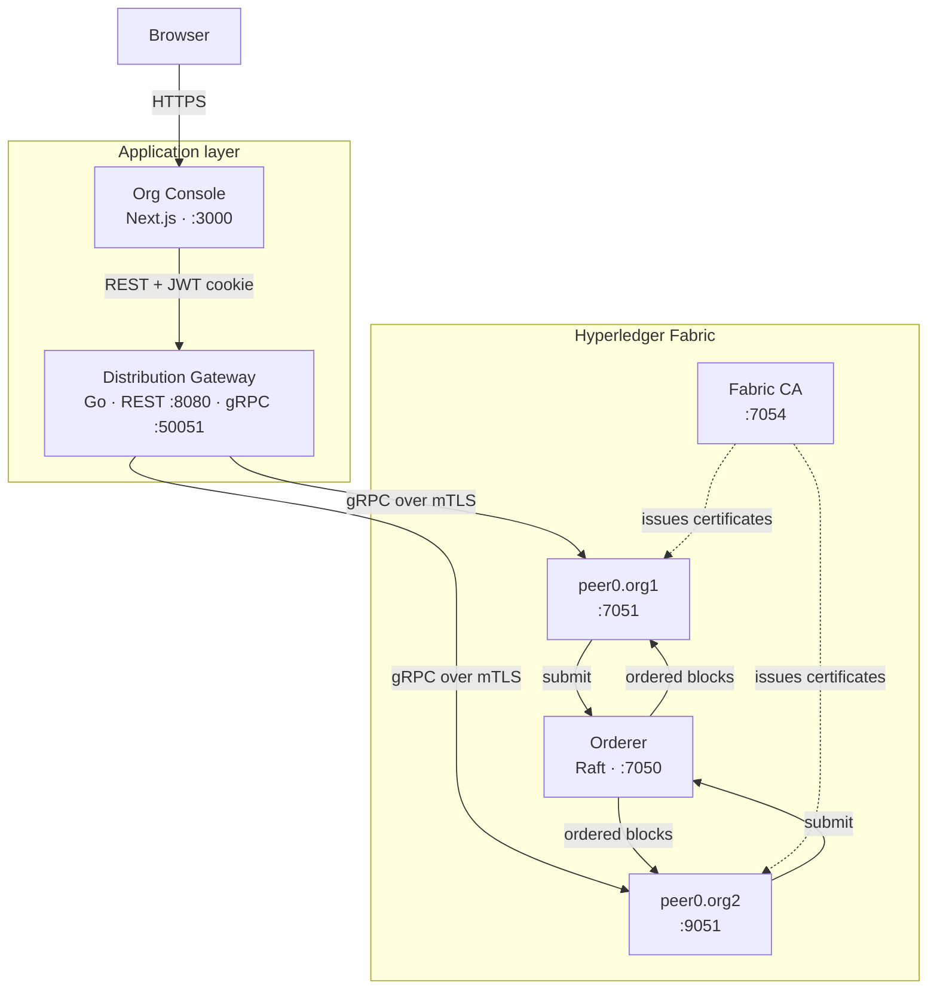
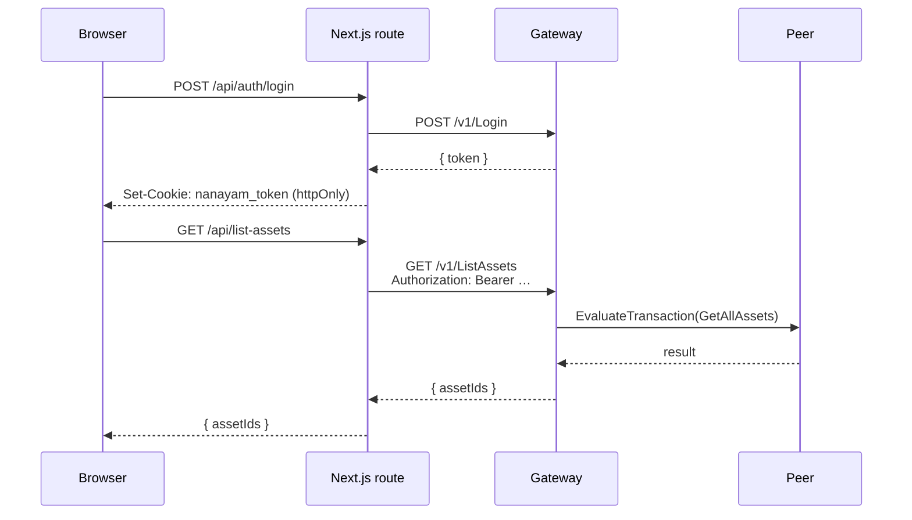
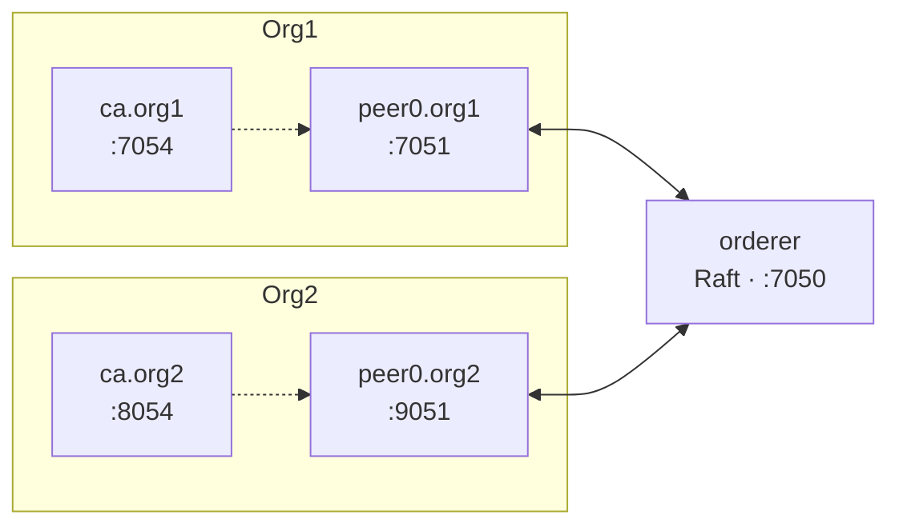
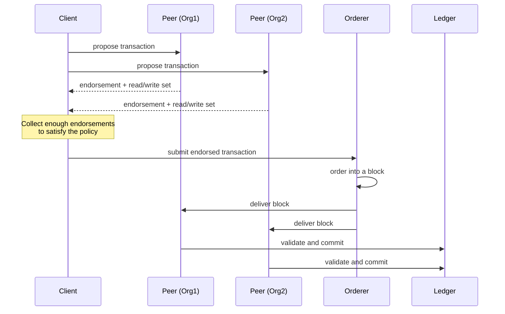

# Architecture

**Languages:** **English** · [தமிழ்](Architecture-ta)

---

## The whole picture

Two distinct identity systems operate here, and conflating them is the most common source of confusion:

- **Console users** authenticate with a username and password, and receive a JWT. This governs who may use the web UI.
- **Fabric identities** are X.509 certificates issued by a Fabric CA. This governs who may sign a transaction the ledger will accept.

The gateway holds a Fabric identity and acts on behalf of authenticated console users. A console account, on its own, cannot write to the ledger.

---

## Org Console (`apps/org-console/`)

A Next.js 15 App Router application.

| Path | Role |
|---|---|
| `src/app/(auth)/` | Login and signup pages |
| `src/app/(console)/` | Dashboard, ledger explorer, channels, complaints |
| `src/app/api/` | Route handlers that proxy to the gateway |
| `src/components/` | UI components |
| `src/lib/` | Shared API client and helpers |

**Why the API routes exist.** The browser never talks to the gateway directly. It calls a Next.js route handler, which attaches the JWT and forwards the request server-side. That keeps the token in an `httpOnly` cookie, out of reach of any JavaScript running on the page — so a cross-site scripting bug cannot lift a live ledger session.

---

## Distribution Gateway (`services/gateway/`)

A Go service exposing the same operations over both gRPC and REST.

| File | Role |
|---|---|
| `main.go` | Starts both servers, wires dependencies, handles shutdown |
| `connection.go` | Builds the Fabric Gateway client from environment config |
| `handler.go` | Implements the gRPC service against Fabric |
| `http.go` | REST routing, CORS, and the auth middleware |
| `auth.go` | User store, bcrypt hashing, JWT issue and validation |

### Submit versus evaluate

Fabric distinguishes two operations, and the gateway maps them onto HTTP methods:

| | Evaluate | Submit |
|---|---|---|
| Writes to the ledger | No | Yes |
| Goes through the orderer | No | Yes |
| Latency | Milliseconds | Block time |
| Used by | `QueryAsset`, `ListAssets` | `CreateAsset`, `SubmitComplaint` |

An evaluate is a read against one peer's local state database. A submit is the full lifecycle: endorsement by enough peers to satisfy the policy, ordering into a block, then validation and commit on every peer.

### Configuration

| Variable | Default | Purpose |
|---|---|---|
| `MSP_ID` | `Org1MSP` | The organisation the gateway acts as |
| `PEER_ENDPOINT` | `peer0.org1.nanayam.com:7051` | Peer to dial |
| `CRYPTO_PATH` | `./crypto-config/…` | Root of the MSP material |
| `TLS_CERT_PATH` | derived | Peer's TLS CA certificate |
| `FABRIC_CHANNEL` | `mychannel` | Channel to transact on |
| `FABRIC_CHAINCODE` | `basic` | Chaincode to call |
| `AUTH_JWT_SECRET` | dev default | HMAC key for signing tokens |
| `AUTH_SIGNUP_ENABLED` | `false` | Whether `/v1/Register` accepts new users |
| `AUTH_SESSION_HOURS` | `24` | Token lifetime |

> `AUTH_JWT_SECRET` has a development default so a fresh clone runs. Any deployment reachable by others must set it. `scripts/deploy-cloud.sh` generates a random one and stores it in a Kubernetes Secret.

---

## Nanayam CLI (`cli/`)

A Cobra application. Each command file under `cmd/` maps to one subcommand.

| Package | Responsibility |
|---|---|
| `cmd/` | Command definitions and their orchestration logic |
| `internal/docker/` | Compose invocation and pre-flight validation of bind mounts |
| `internal/fabric/` | Binary discovery, peer environment construction |
| `internal/ca/` | `fabric-ca-client` wrapper for enrol and register |
| `internal/config/` | Renders node templates into compose and cryptogen files |
| `templates/` | Embedded templates, compiled into the binary |

**Pre-flight validation** is the part worth knowing about. Before `network up` hands anything to Docker, the CLI parses the compose file, resolves every bind mount, and checks that MSP directories contain `signcerts`, TLS directories contain `ca.crt`/`server.crt`/`server.key`, and referenced `.block` files exist and are files. A container that exits immediately because a certificate is missing produces a confusing log; this check produces a sentence naming the file.

---

## The Fabric network

| Config file | Purpose |
|---|---|
| `config/crypto-config.yaml` | Which organisations, peers, and users `cryptogen` should create |
| `config/configtx.yaml` | Channel profiles, MSPs, and policies |
| `config/connection-profile.yaml` | Endpoints for SDK clients |
| `docker/fabric-network.yaml` | The basic two-org network |
| `docker/complaint-network.yaml` | The four-org grievance network |

The complaint network runs four organisations — ACB, Department, Oversight, and Judiciary — precisely so that closing a case requires more than one signature.

---

## Transaction lifecycle

The validation step re-checks the read set against current state. If another transaction changed a key this one read, it is marked invalid at commit time — Fabric's answer to double-spending, without any mining.

---

## See also

- [API Reference](API-Reference) — the endpoints in detail
- [Cloud Deployment](Cloud-Deployment) — how this maps onto Kubernetes
- [`docs/hyperledger-fabric-guide.md`](https://github.com/bytamilan/nanayam/blob/main/docs/hyperledger-fabric-guide.md) — Fabric concepts from first principles
