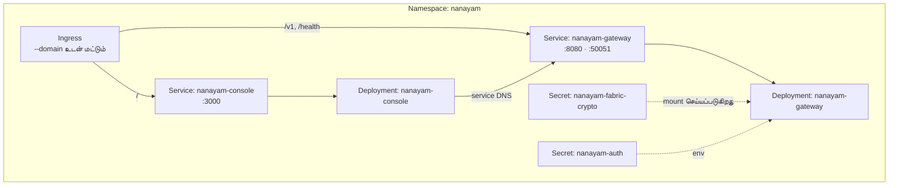

# கிளவுட் நிறுவல்

**மொழிகள்:** [English](Cloud-Deployment.html) · **தமிழ்**

`scripts/deploy-cloud.sh`, உங்கள் `kubectl` தற்போது சுட்டும் எந்த Kubernetes கிளஸ்டரிலும் gateway-யையும் கன்சோலையும் நிறுவும் — GKE, EKS, AKS, k3d, kind, அல்லது நீங்களே நிர்வகிக்கும் கிளஸ்டர்.

---

## சுருக்கமான வழி

```bash
# 1. kubectl-ஐ உங்கள் கிளஸ்டரில் சுட்டுங்கள்
gcloud container clusters get-credentials my-cluster --region us-central1

# 2. நிறுவுங்கள்
./scripts/deploy-cloud.sh \
  --registry ghcr.io/bytamilan \
  --domain nanayam.example.com
```

ஸ்கிரிப்ட் இரு images-ஐயும் உருவாக்கி, push செய்து, Fabric crypto பொருளையும் உருவாக்கப்பட்ட JWT secret-ஐயும் ஏற்றி, manifests-ஐப் பயன்படுத்தி, rollout முடியும் வரை காத்திருக்கிறது.

---

## நிறுவுவதற்கு முன்

| தேவை | ஏன் |
|---|---|
| உங்கள் கிளஸ்டரை அடையும் `kubectl` | அனைத்தும் அதன் வழியாகவே பயன்படுத்தப்படுகிறது |
| `docker` | Images-ஐ உருவாக்குகிறது (`--skip-build` மூலம் தவிர்க்கலாம்) |
| நீங்கள் push செய்யக்கூடிய container registry | கிளஸ்டர் அதிலிருந்து images-ஐ இழுக்கிறது |
| `crypto-config/`-இல் Fabric crypto பொருள் | Gateway-க்கு MSP-யும் TLS சான்றிதழ்களும் தேவை |
| `--domain` பயன்படுத்தினால் ingress controller | வெளிப்புற போக்குவரத்தை வழிநடத்துகிறது |

Crypto பொருள் இல்லையென்றால் முதலில் உருவாக்குங்கள்:

```bash
nanayam crypto generate
```

---

## கிளஸ்டர் அனுமதிகளைப் பெறுதல்

```bash
# Google Kubernetes Engine
gcloud container clusters get-credentials <cluster> --region <region> --project <project>

# Amazon EKS
aws eks update-kubeconfig --name <cluster> --region <region>

# Azure AKS
az aks get-credentials --resource-group <rg> --name <cluster>

# உள்ளூர் k3d
k3d cluster create nanayam
```

`kubectl config current-context` மூலம் உறுதி செய்யுங்கள்.

---

## விருப்பங்கள்

### Images

| Flag | இயல்புநிலை | பொருள் |
|---|---|---|
| `--registry <ref>` | *கட்டாயம்* | Registry முன்னொட்டு, எ.கா. `ghcr.io/bytamilan` |
| `--tag <tag>` | குறுகிய git SHA | Image tag |
| `--skip-build` | முடக்கப்பட்டது | Registry-இல் ஏற்கனவே உள்ள images-ஐப் பயன்படுத்து |
| `--skip-push` | முடக்கப்பட்டது | Push செய்யாமல் உள்ளூரில் உருவாக்கு |

### கிளஸ்டரும் வழிநடத்தலும்

| Flag | இயல்புநிலை | பொருள் |
|---|---|---|
| `--namespace <ns>` | `nanayam` | இலக்கு namespace |
| `--domain <host>` | இல்லை | Ingress-க்கான hostname |
| `--ingress-class <name>` | `nginx` | Ingress class |
| `--gateway-replicas <n>` | `2` | Gateway replicas |
| `--console-replicas <n>` | `2` | கன்சோல் replicas |
| `--wait-timeout <dur>` | `5m` | Rollout-க்காகக் காத்திருக்கும் நேரம் |

### Fabric இணைப்பு

| Flag | இயல்புநிலை | பொருள் |
|---|---|---|
| `--profile <basic\|complaint>` | `basic` | சேனல், chaincode, MSP, பியரை முன்னமைக்கிறது |
| `--channel <name>` | `mychannel` | சேனலை மாற்று |
| `--chaincode <name>` | `basic` | Chaincode-ஐ மாற்று |
| `--msp-id <id>` | `Org1MSP` | MSP id-ஐ மாற்று |
| `--peer <host:port>` | `peer0.org1.nanayam.com:7051` | பியரை மாற்று |
| `--crypto-dir <path>` | பியரிலிருந்து பெறப்படுகிறது | ஏற்ற வேண்டிய crypto பொருள் |
| `--enable-signup` | முடக்கப்பட்டது | சுய பதிவை அனுமதி |

### முறைகள்

| Flag | பொருள் |
|---|---|
| `--dry-run` | உருவாக்கப்பட்ட manifests-ஐ அச்சிடு; எதையும் மாற்றாதே |
| `--destroy` | Namespace-ஐயும் அதிலுள்ள அனைத்தையும் நீக்கு |

---

## எடுத்துக்காட்டுகள்

**பயன்படுத்துவதற்கு முன் முன்னோட்டம்.** `--dry-run`-க்கு கிளஸ்டரோ `kubectl`-ஓ தேவையில்லை:

```bash
./scripts/deploy-cloud.sh --registry ghcr.io/bytamilan --domain nanayam.example.com --dry-run
```

**புகார் நெட்வொர்க்:**

```bash
./scripts/deploy-cloud.sh --registry ghcr.io/bytamilan --profile complaint --domain grievance.example.com
```

இது சேனலை `complaint-channel`, chaincode-ஐ `complaint`, MSP-ஐ `ACBMSP`, பியரை `peer0.acb.nanayam.com` எனத் தானாக அமைக்கும்.

**Registry இல்லாத உள்ளூர் k3d கிளஸ்டர்:**

```bash
./scripts/deploy-cloud.sh --registry nanayam --skip-push
k3d image import nanayam/nanayam-gateway:$(git rev-parse --short HEAD) \
                 nanayam/nanayam-console:$(git rev-parse --short HEAD)
```

**அகற்றுதல்:**

```bash
./scripts/deploy-cloud.sh --destroy
```

---

## என்ன உருவாக்கப்படுகிறது



Manifests `k8s/`-இல், ஸ்கிரிப்ட் மாற்றியமைக்கும் `${NANAYAM_*}` placeholders உடன் உள்ளன. Resource limits, probes, security contexts மாற்ற வேண்டுமெனில் அவற்றை நேரடியாகத் திருத்துங்கள்.

---

## Secrets

இரண்டு உருவாக்கப்படுகின்றன:

**`nanayam-fabric-crypto`** — பியர் நிறுவனத்தின் MSP மற்றும் TLS பொருளை வைத்திருக்கிறது; `/app/crypto`-இல் படிக்க-மட்டும் mount செய்யப்படுகிறது. Image-இல் சுடுவதற்குப் பதிலாக இதை ஏற்றுவதால், ஒரே image ஒவ்வொரு நிறுவனத்திற்கும் சேவை செய்கிறது.

**`nanayam-auth`** — JWT கையொப்ப சாவியை வைத்திருக்கிறது; முதல் நிறுவலின்போது `/dev/urandom`-இலிருந்து உருவாக்கப்படுகிறது. **ஸ்கிரிப்ட் இதை மீண்டும் உருவாக்குவதே இல்லை**: ஒவ்வொரு நிறுவலிலும் அந்தச் சாவியை மாற்றினால் ஒவ்வொரு பயனரும் வெளியேற்றப்படுவார்கள். வேண்டுமென்றே மாற்ற:

```bash
kubectl -n nanayam delete secret nanayam-auth
./scripts/deploy-cloud.sh --registry ghcr.io/bytamilan   # புதியதை உருவாக்கும்
```

---

## நிறுவலை வெளிப்படுத்துதல்

**Domain உடன்**, ingress `/v1` மற்றும் `/health`-ஐ gateway-க்கும், மற்ற அனைத்தையும் கன்சோலுக்கும் வழிநடத்தும். DNS-ஐ உங்கள் ingress controller-ல் சுட்டுங்கள்:

```bash
kubectl get ingress -n nanayam
```

**Domain இல்லாமல்**, வெளியே எதுவும் வெளிப்படுத்தப்படுவதில்லை. Port-forward மூலம் அணுகுங்கள்:

```bash
kubectl -n nanayam port-forward svc/nanayam-console 3000:3000
```

---

## நிறுவலைச் சரிபார்த்தல்

```bash
kubectl -n nanayam get pods
kubectl -n nanayam logs -l app.kubernetes.io/name=nanayam-gateway --tail=100
kubectl -n nanayam describe pod <pod>
kubectl -n nanayam port-forward svc/nanayam-gateway 8080:8080
curl http://localhost:8080/health
```

---

## CI/CD

`.github/workflows/deploy-fabric-operator.yml`, `main`-க்கு push செய்யும்போது Workload Identity Federation பயன்படுத்தி நிறுவுகிறது — நீண்ட காலம் நீடிக்கும் service account சாவிகள் இல்லை.

தேவையான secrets: `WORKLOAD_ID_PROVIDER`, `SERVICE_ACCOUNT`, `CLUSTER_NAME`, `CLUSTER_REGION`, `PROJECT_ID`, `CONTAINER_REGISTRY`.
விருப்ப மாறிகள்: `NANAYAM_NAMESPACE`, `NANAYAM_DOMAIN`.

---

## உற்பத்திச் சரிபார்ப்புப் பட்டியல்

- [ ] `AUTH_JWT_SECRET` மேம்பாட்டு இயல்புநிலையிலிருந்து அல்ல, உண்மையான secret-இலிருந்து வருகிறது
- [ ] `admin` கடவுச்சொல் மாற்றப்பட்டுள்ளது
- [ ] சுய பதிவு உண்மையிலேயே தேவைப்படாவிட்டால் `--enable-signup` முடக்கப்பட்டுள்ளது
- [ ] செல்லுபடியாகும் சான்றிதழுடன் TLS ingress-இல் முடிவடைகிறது
- [ ] Resource requests மற்றும் limits உங்கள் சுமைக்கு ஏற்பச் சரிசெய்யப்பட்டுள்ளன
- [ ] Fabric crypto பொருள் மீட்டெடுக்கக்கூடிய இடத்தில் காப்புப் பிரதி எடுக்கப்பட்டுள்ளது
- [ ] பியர்களும் orderer-களும் ஒற்றை replica அல்ல, உயர் கிடைக்கும் தன்மையுடன் உள்ளன
- [ ] பதிவுகளும் அளவீடுகளும் நீங்கள் உண்மையில் பார்க்கும் இடத்திற்கு அனுப்பப்படுகின்றன

---

## மேலும் பார்க்க

- [தொடங்குதல்](Getting-Started-ta.html) — முதலில் உள்ளூர் மேம்பாடு
- [கட்டமைப்பு](Architecture-ta.html) — இந்தப் பகுதிகள் என்ன செய்கின்றன
- [சிக்கல் தீர்வு](Troubleshooting-ta.html) — rollout முடியாதபோது
