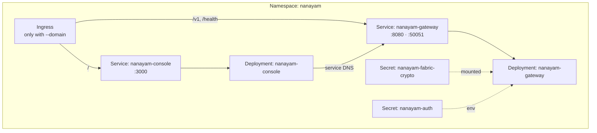

# Cloud Deployment

**Languages:** **English** · [தமிழ்](Cloud-Deployment-ta.html)

`scripts/deploy-cloud.sh` deploys the gateway and console to any Kubernetes cluster your `kubectl` currently points at — GKE, EKS, AKS, k3d, kind, or a self-managed cluster.

---

## The short version

```bash
# 1. Point kubectl at your cluster
gcloud container clusters get-credentials my-cluster --region us-central1

# 2. Deploy
./scripts/deploy-cloud.sh \
  --registry ghcr.io/bytamilan \
  --domain nanayam.example.com
```

The script builds both images, pushes them, uploads the Fabric crypto material and a generated JWT secret, applies the manifests, and waits for the rollout.

---

## Before you deploy

| Requirement | Why |
|---|---|
| `kubectl` reaching your cluster | Everything is applied through it |
| `docker` | Builds the images (skip with `--skip-build`) |
| A container registry you can push to | The cluster pulls images from it |
| Fabric crypto material in `crypto-config/` | The gateway needs an MSP and TLS certs |
| An ingress controller, if using `--domain` | Routes external traffic |

Generate crypto material first if you do not have it:

```bash
nanayam crypto generate
```

---

## Getting cluster credentials

```bash
# Google Kubernetes Engine
gcloud container clusters get-credentials <cluster> --region <region> --project <project>

# Amazon EKS
aws eks update-kubeconfig --name <cluster> --region <region>

# Azure AKS
az aks get-credentials --resource-group <rg> --name <cluster>

# Local k3d
k3d cluster create nanayam
```

Confirm with `kubectl config current-context`.

---

## Options

### Images

| Flag | Default | Meaning |
|---|---|---|
| `--registry <ref>` | *required* | Registry prefix, e.g. `ghcr.io/bytamilan` |
| `--tag <tag>` | short git SHA | Image tag |
| `--skip-build` | off | Reuse images already in the registry |
| `--skip-push` | off | Build locally without pushing |

### Cluster and routing

| Flag | Default | Meaning |
|---|---|---|
| `--namespace <ns>` | `nanayam` | Target namespace |
| `--domain <host>` | none | Hostname for the ingress |
| `--ingress-class <name>` | `nginx` | Ingress class |
| `--gateway-replicas <n>` | `2` | Gateway replicas |
| `--console-replicas <n>` | `2` | Console replicas |
| `--wait-timeout <dur>` | `5m` | How long to wait for rollout |

### Fabric wiring

| Flag | Default | Meaning |
|---|---|---|
| `--profile <basic\|complaint>` | `basic` | Presets channel, chaincode, MSP, peer |
| `--channel <name>` | `mychannel` | Override the channel |
| `--chaincode <name>` | `basic` | Override the chaincode |
| `--msp-id <id>` | `Org1MSP` | Override the MSP id |
| `--peer <host:port>` | `peer0.org1.nanayam.com:7051` | Override the peer |
| `--crypto-dir <path>` | derived from the peer | Crypto material to upload |
| `--enable-signup` | off | Allow self-registration |

### Modes

| Flag | Meaning |
|---|---|
| `--dry-run` | Print the rendered manifests; change nothing |
| `--destroy` | Delete the namespace and everything in it |

---

## Worked examples

**Preview before applying.** `--dry-run` needs neither a cluster nor `kubectl`:

```bash
./scripts/deploy-cloud.sh --registry ghcr.io/bytamilan --domain nanayam.example.com --dry-run
```

**The complaint network:**

```bash
./scripts/deploy-cloud.sh --registry ghcr.io/bytamilan --profile complaint --domain grievance.example.com
```

That presets the channel to `complaint-channel`, the chaincode to `complaint`, the MSP to `ACBMSP`, and the peer to `peer0.acb.nanayam.com`.

**A local k3d cluster with no registry:**

```bash
./scripts/deploy-cloud.sh --registry nanayam --skip-push
k3d image import nanayam/nanayam-gateway:$(git rev-parse --short HEAD) \
                 nanayam/nanayam-console:$(git rev-parse --short HEAD)
```

**Tear it down:**

```bash
./scripts/deploy-cloud.sh --destroy
```

---

## What gets created



The manifests live in `k8s/` with `${NANAYAM_*}` placeholders that the script substitutes. Edit them directly if you need to change resource limits, probes, or security contexts.

---

## Secrets

Two are created:

**`nanayam-fabric-crypto`** holds the peer organisation's MSP and TLS material, mounted read-only at `/app/crypto`. Uploading it rather than baking it into the image means the same image serves every organisation.

**`nanayam-auth`** holds the JWT signing key, generated from `/dev/urandom` on first deploy. **The script never regenerates it**: rotating that key on every deploy would sign every user out. To rotate deliberately:

```bash
kubectl -n nanayam delete secret nanayam-auth
./scripts/deploy-cloud.sh --registry ghcr.io/bytamilan   # generates a fresh one
```

---

## Exposing the deployment

**With a domain**, the ingress routes `/v1` and `/health` to the gateway and everything else to the console. Point DNS at your ingress controller:

```bash
kubectl get ingress -n nanayam
```

**Without a domain**, nothing is exposed externally. Reach it by port-forwarding:

```bash
kubectl -n nanayam port-forward svc/nanayam-console 3000:3000
```

---

## Checking a deployment

```bash
kubectl -n nanayam get pods
kubectl -n nanayam logs -l app.kubernetes.io/name=nanayam-gateway --tail=100
kubectl -n nanayam describe pod <pod>
kubectl -n nanayam port-forward svc/nanayam-gateway 8080:8080
curl http://localhost:8080/health
```

---

## CI/CD

`.github/workflows/deploy-fabric-operator.yml` deploys on push to `main` using Workload Identity Federation — no long-lived service account keys.

Required secrets: `WORKLOAD_ID_PROVIDER`, `SERVICE_ACCOUNT`, `CLUSTER_NAME`, `CLUSTER_REGION`, `PROJECT_ID`, `CONTAINER_REGISTRY`.
Optional variables: `NANAYAM_NAMESPACE`, `NANAYAM_DOMAIN`.

---

## Production checklist

- [ ] `AUTH_JWT_SECRET` comes from a real secret, not the development default
- [ ] The `admin` password has been changed
- [ ] `--enable-signup` is off unless self-registration is genuinely wanted
- [ ] TLS terminates at the ingress with a valid certificate
- [ ] Resource requests and limits are tuned for your load
- [ ] Fabric crypto material is backed up somewhere you can restore from
- [ ] Peers and orderers are highly available, not single replicas
- [ ] Logs and metrics ship somewhere you will actually look

---

## See also

- [Getting Started](Getting-Started.html) — local development first
- [Architecture](Architecture.html) — what these components do
- [Troubleshooting](Troubleshooting.html) — when a rollout does not complete
