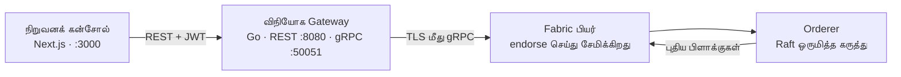

# நாணயம் விக்கி

> **நாணயம்** — தமிழில் *காசு* என்றும் *நேர்மை* என்றும் பொருள் தரும் சொல். ஒரு பேரேடு இரண்டையும் சுமக்க வேண்டும்.

**மொழிகள்:** [English](Home) · **தமிழ்**

நாணயம் என்பது [Hyperledger Fabric](https://www.hyperledger.org/use/fabric) அடிப்படையில் கட்டப்பட்ட, அனுமதி பெற்றவர்கள் மட்டுமே பயன்படுத்தக்கூடிய தனியார் Web3 பேரேடு (ledger). இது முழுமையான தொகுப்பாக வருகிறது: ஒரு Fabric நெட்வொர்க், gRPC மற்றும் REST இரண்டையும் பேசும் Go gateway, ஒரு Next.js கன்சோல் — இவை அனைத்தையும் இயக்கும் ஒரே CLI உடன்.

---

## இங்கிருந்து தொடங்குங்கள்

| எனக்கு வேண்டியது… | இங்கே செல்லுங்கள் |
|---|---|
| பத்து நிமிடங்களில் என் கணினியில் நாணயத்தை இயக்க வேண்டும் | [தொடங்குதல்](Getting-Started-ta) |
| பகுதிகள் எப்படி ஒன்றிணைகின்றன என்று புரிந்துகொள்ள வேண்டும் | [கட்டமைப்பு](Architecture-ta) |
| ஒரு கட்டளையைத் தேட வேண்டும் | [CLI கையேடு](CLI-Reference-ta) |
| கிளவுட் கிளஸ்டரில் நிறுவ வேண்டும் | [கிளவுட் நிறுவல்](Cloud-Deployment-ta) |
| என் நிரலிலிருந்து gateway-ஐ அழைக்க வேண்டும் | [API கையேடு](API-Reference-ta) |
| சோதனைகளை இயக்க அல்லது எழுத வேண்டும் | [சோதனை](Testing-ta) |
| உடைந்த ஒன்றைச் சரிசெய்ய வேண்டும் | [சிக்கல் தீர்வு](Troubleshooting-ta) |
| ஒரு மாற்றத்தைப் பங்களிக்க வேண்டும் | [பங்களிப்பு](Contributing-ta) |

---

## நாணயம் எதற்காக

பொது பிளாக்செயினில் ஒவ்வொரு பரிவர்த்தனையும் அனைவருக்கும் தெரியும். ஒரு அரசுத் துறைக்கோ, மருத்துவமனைக்கோ, வங்கிகளின் கூட்டமைப்புக்கோ அது சரியான வடிவம் அல்ல: அவர்களுக்குப் பகிரப்பட்ட, திருத்த முடியாத பதிவு **மற்றும்** யார் படிக்கலாம் என்பதன் மீதான கட்டுப்பாடு — இரண்டும் தேவை.

நாணயம் அந்தத் தேவைக்காகவே கட்டப்பட்டது:

- **அனுமதி அடிப்படையிலானது.** ஒவ்வொரு பங்கேற்பாளரும் வழங்கப்பட்ட சான்றிதழை வைத்திருக்கிறார்கள். அடையாளம் தெரியாத எழுத்தாளர்கள் கிடையாது.
- **தனியுரிமை.** தரவு சேனல்களில் (channels) வாழ்கிறது. ஒரு சேனலுக்கு வெளியே உள்ள நிறுவனம், நெட்வொர்க்கின் உள்ளிருந்தும் அதைப் படிக்க முடியாது.
- **திருத்தம் வெளிப்படும்.** ஒவ்வொரு பிளாக்கும் அதற்கு முந்தையதின் ஹாஷைச் சுமக்கிறது. பழைய வரலாற்றை மாற்றுவது என்றால், அதற்குப் பிறகு உள்ள அனைத்தையும் — ஒவ்வொரு பியரிலும், ஒரே நேரத்தில் — மீண்டும் எழுத வேண்டும்.
- **மைனிங் இல்லை.** வரிசைப்படுத்துதல் Raft கிளஸ்டரால் செய்யப்படுகிறது. எனவே proof-of-work செலவு இல்லை, கிரிப்டோகரன்சியும் இதில் இல்லை.

நாணயத்துடன் வரும் எடுத்துக்காட்டு **பொது புகார் அமைப்பு**: ஒரு குடிமகன் புகார் அளிக்கிறார், ஊழல் தடுப்புப் பிரிவு அதை ஏற்றுக்கொள்கிறது, ஒரு துறை விசாரிக்கிறது, மேற்பார்வை அமைப்பு இணைந்து கையொப்பமிட்ட பிறகே வழக்கை மூட முடியும். எந்த ஒரு நிறுவனமும் தனியாக அமைதியாக வழக்கை மூட முடியாது — ஏனெனில் endorsement கொள்கை பல நிறுவனங்களின் கையொப்பங்களைக் கோருகிறது.

---

## மூன்று பகுதிகள்



| பகுதி | கோப்பகம் | என்ன செய்கிறது |
|---|---|---|
| நிறுவனக் கன்சோல் | `apps/org-console/` | வலை இடைமுகம். உள்நுழைவு, பேரேடு உலாவி, புகார் பணிப்பாய்வு. |
| விநியோக Gateway | `services/gateway/` | REST மற்றும் gRPC-ஐ Fabric பரிவர்த்தனைகளாக மாற்றுகிறது. JWT அங்கீகாரப் படுக்கையை வைத்திருக்கிறது. |
| நாணயம் CLI | `cli/` | நெட்வொர்க்குகளை எழுப்புகிறது, crypto உருவாக்குகிறது, சேனல், chaincode, அடையாளங்களை நிர்வகிக்கிறது. |
| Fabric நெட்வொர்க் | `docker/`, `config/` | பியர்கள், ஆர்டரர்கள், CA-க்கள் — Docker Compose தொகுப்புகளாக. |

---

## மிகக் குறுகிய வழி

```bash
curl -fsSL https://raw.githubusercontent.com/bytamilan/nanayam/main/install.sh | bash

nanayam prerequisites --auto
nanayam network up
```

பிறகு <http://localhost:3000> திறக்கவும். ஒவ்வொரு படியும் உண்மையில் என்ன செய்கிறது என்பது உட்பட முழு விளக்கம் [தொடங்குதல்](Getting-Started-ta) பக்கத்தில் உள்ளது.

---

## திட்ட இணைப்புகள்

- [களஞ்சியம் (Repository)](https://github.com/bytamilan/nanayam)
- [சிக்கல்கள் (Issues)](https://github.com/bytamilan/nanayam/issues)
- [MIT உரிமம்](https://github.com/bytamilan/nanayam/blob/main/LICENSE)
