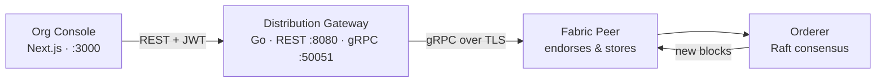

# Nanayam Wiki

> **நாணயம்** — a Tamil word meaning both *coin* and *integrity*. A ledger should carry both.

**Languages:** **English** · [தமிழ்](Home-ta)

Nanayam is a private, permissioned Web3 ledger built on [Hyperledger Fabric](https://www.hyperledger.org/use/fabric). It ships a complete stack: a Fabric network, a Go gateway that speaks gRPC and REST, and a Next.js console — plus one CLI that drives all of it.

---

## Start here

| I want to… | Go to |
|---|---|
| Run Nanayam on my laptop in ten minutes | [Getting Started](Getting-Started) |
| Understand how the pieces fit together | [Architecture](Architecture) |
| Look up a command | [CLI Reference](CLI-Reference) |
| Deploy to a cloud cluster | [Cloud Deployment](Cloud-Deployment) |
| Call the gateway from my own code | [API Reference](API-Reference) |
| Run or write tests | [Testing](Testing) |
| Fix something that broke | [Troubleshooting](Troubleshooting) |
| Contribute a change | [Contributing](Contributing) |

---

## What Nanayam is for

A public blockchain makes every transaction visible to everyone. That is the wrong shape for a government department, a hospital, or a consortium of banks: they need a shared, tamper-evident record **and** control over who can read it.

Nanayam is built for that case:

- **Permissioned.** Every participant holds an issued certificate. There are no anonymous writers.
- **Private.** Data lives on channels. An organisation outside a channel cannot read it, even from inside the network.
- **Tamper-evident.** Each block carries the hash of the one before it. Altering old history means rewriting everything after it, on every peer at once.
- **No mining.** Ordering is done by a Raft cluster, so there is no proof-of-work cost and no cryptocurrency involved.

The worked example that ships with Nanayam is a **public grievance system**: a citizen files a complaint, an anti-corruption bureau acknowledges it, a department investigates, and an oversight body must co-sign before it can be closed. No single organisation can quietly close a case, because the endorsement policy requires signatures from several.

---

## The three components



| Component | Directory | What it does |
|---|---|---|
| Org Console | `apps/org-console/` | The web UI. Sign-in, ledger explorer, complaint workflow. |
| Distribution Gateway | `services/gateway/` | Translates REST and gRPC into Fabric transactions. Holds the JWT auth layer. |
| Nanayam CLI | `cli/` | Brings up networks, generates crypto, manages channels, chaincode, and identities. |
| Fabric network | `docker/`, `config/` | Peers, orderers, and CAs as Docker Compose stacks. |

---

## The shortest path

```bash
curl -fsSL https://raw.githubusercontent.com/bytamilan/nanayam/main/install.sh | bash

nanayam prerequisites --auto
nanayam network up
```

Then open <http://localhost:3000>. The full walkthrough, including what each step actually does, is in [Getting Started](Getting-Started).

---

## Project links

- [Repository](https://github.com/bytamilan/nanayam)
- [Issues](https://github.com/bytamilan/nanayam/issues)
- [MIT License](https://github.com/bytamilan/nanayam/blob/main/LICENSE)
